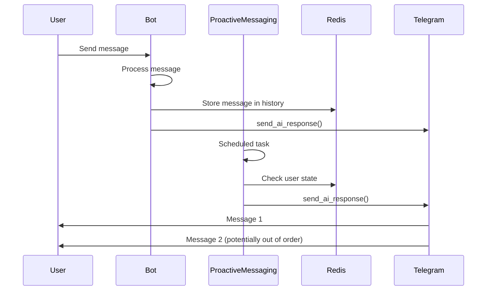
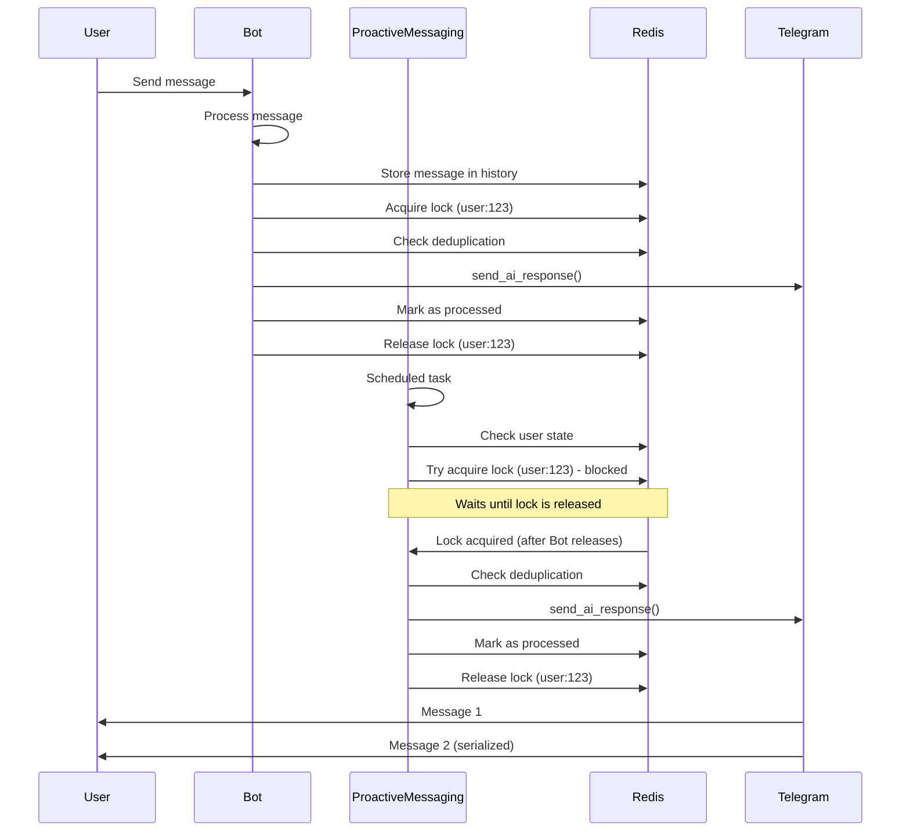
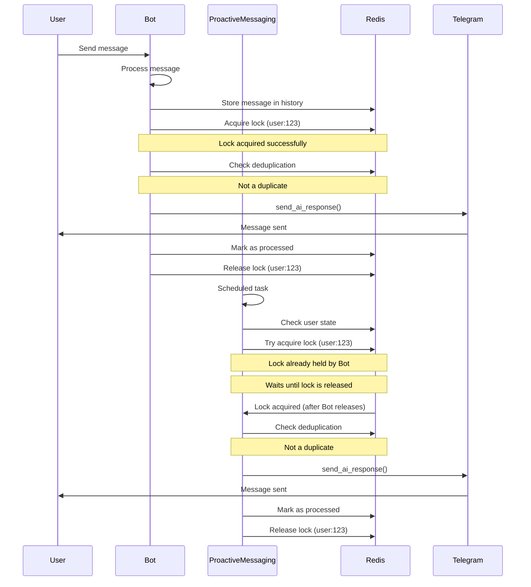
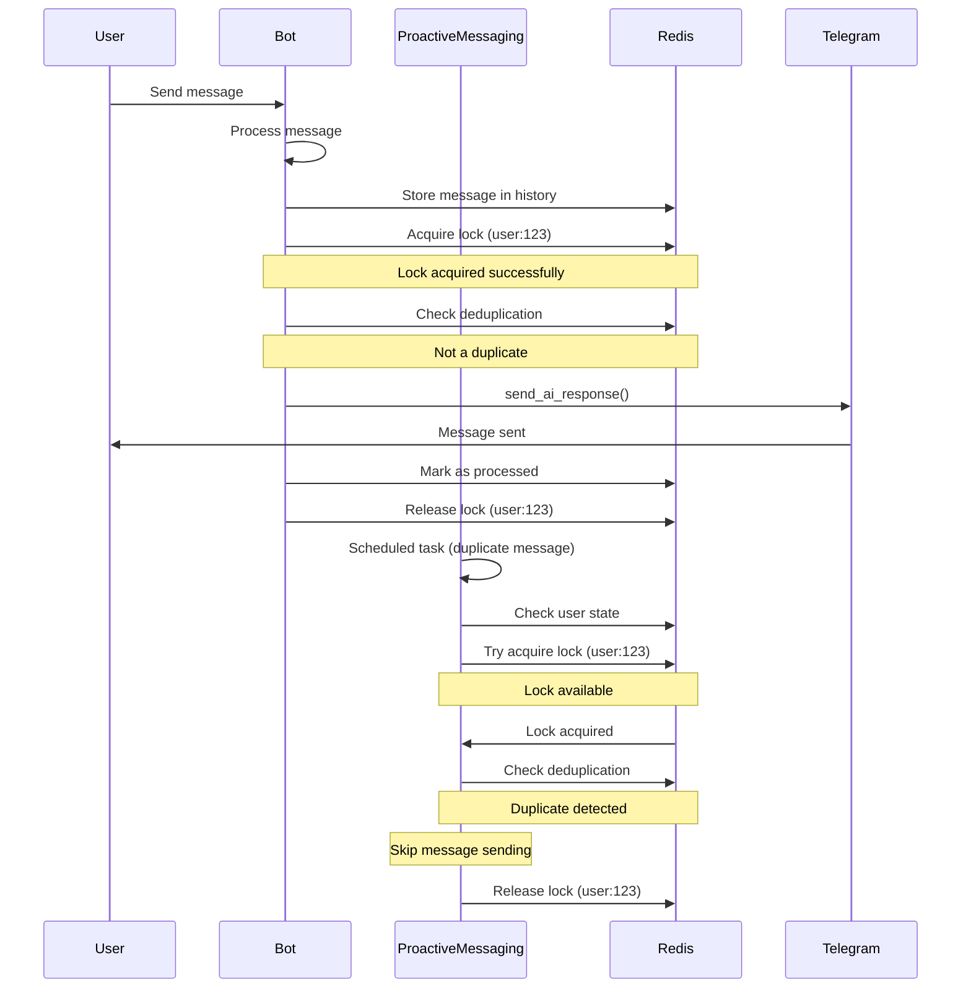

# Architectural Design: Preventing Parallel Execution of send_ai_response

## 1. Overview

This document outlines the architectural design for preventing parallel execution of the `send_ai_response` function for the same user in the AI Girlfriend Bot system. The solution combines Redis-based distributed locks with message deduplication to ensure serialized execution while maintaining system performance and reliability.

## 2. Problem Statement

The `send_ai_response` function can be called in parallel from multiple sources:
1. Regular message processing flow in `bot.py`
2. Proactive messaging system in `proactive_messaging.py`

Parallel execution can cause several issues:
- Message ordering problems leading to inconsistent user experience
- Resource contention and potential race conditions
- Duplicate message delivery to users
- Inconsistent conversation history state

## 3. Current System Context

The application currently uses:
- Redis for Celery task queuing and proactive messaging
- PostgreSQL for data storage
- Celery for distributed task processing
- Telegram bot for user interactions

The existing system already implements distributed locking mechanisms in some components, providing a foundation for the proposed solution.

## 4. Solution Approach

### 4.1 Recommended Solution: Redis-Based Distributed Locks with Message Deduplication

Based on the analysis in `message_queue_analysis.md`, we recommend implementing a solution that combines:
1. **Redis-based distributed locks** to ensure only one instance of `send_ai_response` runs for each user at a time
2. **Message deduplication** to prevent processing the same message multiple times

### 4.2 Why This Approach?

1. **Leverages Existing Infrastructure**: The project already uses Redis for Celery and proactive messaging
2. **Works in Distributed Environments**: Unlike in-memory locks, Redis-based locks work across multiple application instances
3. **Provides Strong Guarantees**: Distributed locks ensure serialized execution
4. **Adds Resilience**: Message deduplication provides an additional layer of protection
5. **Good Performance**: Redis provides low-latency lock operations

## 5. Detailed Design

### 5.1 DistributedLockManager Class

#### 5.1.1 Class Definition

```python
import uuid
import time
import logging
from typing import Optional

logger = logging.getLogger(__name__)

class DistributedLockManager:
    def __init__(self, redis_client, default_timeout=30):
        """
        Initialize the DistributedLockManager.
        
        Args:
            redis_client: Redis client instance
            default_timeout: Default lock expiration time in seconds
        """
        self.redis_client = redis_client
        self.default_timeout = default_timeout
    
    def acquire_lock(self, lock_key: str, timeout: int = None) -> Optional[str]:
        """
        Acquire a distributed lock.
        
        Args:
            lock_key: Unique key for the lock (e.g., "send_ai_response:user:12345")
            timeout: Lock expiration time in seconds (defaults to default_timeout)
            
        Returns:
            Lock identifier if acquired, None otherwise
        """
        if timeout is None:
            timeout = self.default_timeout
            
        lock_id = str(uuid.uuid4())
        lock_key = f"distributed_lock:{lock_key}"
        
        try:
            # Try to set the lock with NX (not exists) and EX (expire) options
            acquired = self.redis_client.set(lock_key, lock_id, nx=True, ex=timeout)
            if acquired:
                logger.debug(f"Acquired distributed lock: {lock_key}")
                return lock_id
            else:
                logger.debug(f"Failed to acquire distributed lock: {lock_key}")
                return None
        except Exception as e:
            logger.error(f"Error acquiring distributed lock {lock_key}: {e}")
            return None
    
    def release_lock(self, lock_key: str, lock_id: str):
        """
        Release a distributed lock.
        
        Args:
            lock_key: Unique key for the lock
            lock_id: Lock identifier returned by acquire_lock
        """
        lock_key = f"distributed_lock:{lock_key}"
        
        # Lua script to atomically check and delete the lock
        lua_script = """
        if redis.call("GET", KEYS[1]) == ARGV[1] then
            return redis.call("DEL", KEYS[1])
        else
            return 0
        end
        """
        
        try:
            result = self.redis_client.eval(lua_script, 1, lock_key, lock_id)
            if result:
                logger.debug(f"Released distributed lock: {lock_key}")
            else:
                logger.warning(f"Failed to release distributed lock: {lock_key} (not owner)")
        except Exception as e:
            logger.error(f"Error releasing distributed lock {lock_key}: {e}")
    
    def is_locked(self, lock_key: str) -> bool:
        """
        Check if a lock is currently held.
        
        Args:
            lock_key: Unique key for the lock
            
        Returns:
            True if lock is held, False otherwise
        """
        lock_key = f"distributed_lock:{lock_key}"
        try:
            return self.redis_client.exists(lock_key) > 0
        except Exception as e:
            logger.error(f"Error checking lock status {lock_key}: {e}")
            return False
    
    def extend_lock(self, lock_key: str, lock_id: str, additional_time: int) -> bool:
        """
        Extend the expiration time of an existing lock.
        
        Args:
            lock_key: Unique key for the lock
            lock_id: Lock identifier
            additional_time: Additional time in seconds to extend the lock
            
        Returns:
            True if lock was extended, False otherwise
        """
        lock_key = f"distributed_lock:{lock_key}"
        
        # Lua script to atomically check and extend the lock
        lua_script = """
        if redis.call("GET", KEYS[1]) == ARGV[1] then
            return redis.call("EXPIRE", KEYS[1], ARGV[2])
        else
            return 0
        end
        """
        
        try:
            result = self.redis_client.eval(lua_script, 1, lock_key, lock_id, additional_time)
            if result:
                logger.debug(f"Extended distributed lock: {lock_key} for {additional_time} seconds")
                return True
            else:
                logger.warning(f"Failed to extend distributed lock: {lock_key} (not owner)")
                return False
        except Exception as e:
            logger.error(f"Error extending distributed lock {lock_key}: {e}")
            return False
```

#### 5.1.2 Implementation Details

The `DistributedLockManager` will use Redis `SET` command with `NX` and `EX` options to create distributed locks with expiration times:

1. **Lock Acquisition**: Use `SET lock_key lock_id NX EX timeout` to atomically set a lock only if it doesn't exist
2. **Lock Release**: Use a Lua script to atomically check the lock identifier and delete the key if it matches
3. **Lock Validation**: Check if a key exists to determine if a lock is held
4. **Lock Extension**: Provide a mechanism to extend lock expiration time for long-running operations

#### 5.1.3 Key Design Considerations

1. **Lock Key Naming**: All lock keys are prefixed with "distributed_lock:" to avoid namespace conflicts
2. **UUID-based Lock IDs**: Each lock acquisition generates a unique identifier to prevent accidental lock release by different processes
3. **Atomic Operations**: Lock release and extension use Lua scripts to ensure atomicity
4. **Error Handling**: All Redis operations are wrapped in try-catch blocks with appropriate logging
5. **Automatic Expiration**: Locks automatically expire to prevent deadlocks
6. **Logging**: Detailed logging for debugging and monitoring purposes

### 5.2 Message Deduplication Manager

#### 5.2.1 Class Definition

```python
import hashlib
import logging
from typing import Optional

logger = logging.getLogger(__name__)

class MessageDeduplicationManager:
    def __init__(self, redis_client, default_expiration=300):
        """
        Initialize the MessageDeduplicationManager.
        
        Args:
            redis_client: Redis client instance
            default_expiration: Default expiration time for processed messages in seconds
        """
        self.redis_client = redis_client
        self.default_expiration = default_expiration
    
    def generate_message_id(self, user_id: int, message_content: str) -> str:
        """
        Generate a unique message ID based on user ID and message content.
        
        Args:
            user_id: Telegram user ID
            message_content: Content of the message
            
        Returns:
            Unique message identifier
        """
        # Create a hash of the user ID and message content
        content_hash = hashlib.sha256(message_content.encode('utf-8')).hexdigest()
        return f"{user_id}:{content_hash}"
    
    def is_duplicate(self, message_id: str) -> bool:
        """
        Check if a message has already been processed.
        
        Args:
            message_id: Unique message identifier
            
        Returns:
            True if message is a duplicate, False otherwise
        """
        try:
            key = f"processed_msg:{message_id}"
            return self.redis_client.exists(key) > 0
        except Exception as e:
            logger.error(f"Error checking duplicate message {message_id}: {e}")
            return False
    
    def mark_as_processed(self, message_id: str, expiration_time: int = None):
        """
        Mark a message as processed.
        
        Args:
            message_id: Unique message identifier
            expiration_time: Expiration time in seconds (defaults to default_expiration)
        """
        if expiration_time is None:
            expiration_time = self.default_expiration
            
        try:
            key = f"processed_msg:{message_id}"
            self.redis_client.setex(key, expiration_time, "1")
            logger.debug(f"Marked message {message_id} as processed with expiration {expiration_time}s")
        except Exception as e:
            logger.error(f"Error marking message {message_id} as processed: {e}")
```

#### 5.2.2 Implementation Details

The `MessageDeduplicationManager` uses Redis to track processed messages:

1. **Message ID Generation**: Creates a unique identifier based on user ID and message content hash
2. **Duplicate Check**: Uses `EXISTS` command to check if a message has been processed
3. **Mark as Processed**: Uses `SETEX` command to store processed messages with expiration

#### 5.2.3 Key Design Considerations

1. **Message ID Format**: Uses "user_id:content_hash" format to ensure uniqueness
2. **Content Hashing**: Uses SHA-256 to create a consistent hash of message content
3. **Automatic Expiration**: Processed messages automatically expire to prevent unbounded memory growth
4. **Error Handling**: All Redis operations are wrapped in try-catch blocks with appropriate logging
5. **Logging**: Detailed logging for debugging and monitoring purposes
6. **Configurable Expiration**: Allows customization of expiration time based on application needs

### 5.3 Safe Wrapper for send_ai_response

#### 5.3.1 Function Definition

```python
import asyncio
import logging
import hashlib
from typing import Optional
from message_manager import send_ai_response

logger = logging.getLogger(__name__)

async def send_ai_response_safe(
    chat_id: int,
    text: str,
    bot,
    typing_manager: 'TypingIndicatorManager' = None,
    lock_manager: DistributedLockManager = None,
    dedup_manager: MessageDeduplicationManager = None,
    lock_timeout: int = 30
):
    """
    Safe wrapper for send_ai_response that prevents parallel execution for the same user.
    
    Args:
        chat_id: Telegram chat ID (user ID)
        text: Message text to send
        bot: Telegram bot instance
        typing_manager: TypingIndicatorManager instance
        lock_manager: DistributedLockManager instance
        dedup_manager: MessageDeduplicationManager instance
        lock_timeout: Lock timeout in seconds
        
    Returns:
        True if message was sent, False if duplicate or lock acquisition failed
    """
    # Validate required parameters
    if not text or not bot:
        logger.error("Invalid parameters: text and bot are required")
        return False
    
    # Generate lock key based on user ID
    lock_key = f"send_ai_response:user:{chat_id}"
    
    # Generate message ID for deduplication
    message_id = None
    if dedup_manager:
        message_id = dedup_manager.generate_message_id(chat_id, text)
        
        # Check if this is a duplicate message
        if dedup_manager.is_duplicate(message_id):
            logger.info(f"Skipping duplicate message for user {chat_id}")
            return False
    
    # Attempt to acquire lock
    lock_id = None
    if lock_manager:
        lock_id = lock_manager.acquire_lock(lock_key, lock_timeout)
        if not lock_id:
            logger.warning(f"Failed to acquire lock for user {chat_id}")
            return False
    
    try:
        # Send the message using the original function
        await send_ai_response(chat_id, text, bot, typing_manager)
        
        # Mark message as processed if deduplication manager is available
        if dedup_manager and message_id:
            dedup_manager.mark_as_processed(message_id)
        
        logger.info(f"Successfully sent message to user {chat_id}")
        return True
        
    except Exception as e:
        logger.error(f"Error sending message to user {chat_id}: {e}")
        return False
        
    finally:
        # Always release the lock if we acquired it
        if lock_manager and lock_id:
            lock_manager.release_lock(lock_key, lock_id)
```

#### 5.3.2 Implementation Logic

1. **Parameter Validation**: Check that required parameters are provided
2. **Lock Key Generation**: Create a user-specific lock key
3. **Deduplication Check**: Generate message ID and check if it's a duplicate
4. **Lock Acquisition**: Acquire a user-specific lock with timeout
5. **Message Sending**: Call the original `send_ai_response` function
6. **Mark as Processed**: Mark the message as processed in deduplication manager
7. **Lock Release**: Release the user-specific lock in a finally block to ensure it's always released

#### 5.3.3 Key Design Considerations

1. **Error Handling**: All operations are wrapped in try-catch blocks with appropriate logging
2. **Resource Cleanup**: Locks are released in a finally block to ensure they're always released
3. **Graceful Degradation**: If lock manager or dedup manager are not provided, the function falls back to basic operation
4. **Logging**: Detailed logging for debugging and monitoring purposes
5. **Return Values**: Clear return values to indicate success or failure
6. **Timeout Handling**: Configurable lock timeout to prevent indefinite blocking

### 5.4 Integration with Existing Components

#### 5.4.1 Bot Message Processing Flow

In `bot.py`, the `_dispatch_buffered_message` function calls `send_ai_response`. This will be updated to use `send_ai_response_safe`.

**Current Implementation:**
```python
# In bot.py::_dispatch_buffered_message
await send_ai_response(chat_id=chat_id, text=cleaned_ai_response, bot=bot, typing_manager=self.typing_manager)
```

**Updated Implementation:**
```python
# In bot.py::_dispatch_buffered_message
# Initialize lock manager and deduplication manager (preferably at application startup)
lock_manager = DistributedLockManager(redis_client)
dedup_manager = MessageDeduplicationManager(redis_client)

# Use the safe wrapper
success = await send_ai_response_safe(
    chat_id=chat_id,
    text=cleaned_ai_response,
    bot=bot,
    typing_manager=self.typing_manager,
    lock_manager=lock_manager,
    dedup_manager=dedup_manager
)

if not success:
    logger.warning(f"Failed to send AI response to user {user_id}")
```

#### 5.4.2 Proactive Messaging System

In `proactive_messaging.py`, the `send_proactive_message` Celery task calls `send_ai_response`. This will be updated to use `send_ai_response_safe`.

**Current Implementation:**
```python
# In proactive_messaging.py::send_proactive_message
await send_ai_response(chat_id=user_id, text=cleaned_response, bot=bot, typing_manager=typing_manager)
```

**Updated Implementation:**
```python
# In proactive_messaging.py::send_proactive_message
# Initialize lock manager and deduplication manager (preferably at application startup)
lock_manager = DistributedLockManager(redis_client)
dedup_manager = MessageDeduplicationManager(redis_client)

# Use the safe wrapper
success = await send_ai_response_safe(
    chat_id=user_id,
    text=cleaned_response,
    bot=bot,
    typing_manager=typing_manager,
    lock_manager=lock_manager,
    dedup_manager=dedup_manager
)

if not success:
    logger.warning(f"Failed to send proactive message to user {user_id}")
```

#### 5.4.3 Component Initialization

To ensure efficient operation, the lock manager and deduplication manager should be initialized once at application startup and reused across all calls:

```python
# In application initialization (e.g., in bot.py::__init__)
from redis import from_url
from config import PROACTIVE_MESSAGING_REDIS_URL

# Initialize Redis client
redis_client = from_url(PROACTIVE_MESSAGING_REDIS_URL)

# Initialize managers
self.lock_manager = DistributedLockManager(redis_client)
self.dedup_manager = MessageDeduplicationManager(redis_client)
```

Then pass these instances to the safe wrapper function:
```python
# In bot.py::_dispatch_buffered_message
success = await send_ai_response_safe(
    chat_id=chat_id,
    text=cleaned_ai_response,
    bot=bot,
    typing_manager=self.typing_manager,
    lock_manager=self.lock_manager,
    dedup_manager=self.dedup_manager
)
```

#### 5.4.4 Error Handling and Fallback

For systems where Redis might be temporarily unavailable, consider implementing a fallback mechanism:

```python
async def send_ai_response_safe_with_fallback(
    chat_id: int,
    text: str,
    bot,
    typing_manager: 'TypingIndicatorManager' = None,
    lock_manager: DistributedLockManager = None,
    dedup_manager: MessageDeduplicationManager = None,
    lock_timeout: int = 30
):
    """
    Safe wrapper with fallback to original function if Redis is unavailable.
    """
    # Try to use safe wrapper with distributed locking
    if lock_manager and dedup_manager:
        try:
            return await send_ai_response_safe(
                chat_id, text, bot, typing_manager, lock_manager, dedup_manager, lock_timeout
            )
        except Exception as e:
            logger.warning(f"Distributed locking failed, falling back to direct send: {e}")
    
    # Fallback to direct send
    try:
        await send_ai_response(chat_id, text, bot, typing_manager)
        return True
    except Exception as e:
        logger.error(f"Error sending message to user {chat_id}: {e}")
        return False
```

## 6. Sequence Diagrams

### 6.1 Current Flow (Without Protection)



### 6.2 Proposed Flow (With Protection)



### 6.3 Detailed Flow with Error Handling



### 6.4 Flow with Duplicate Message Detection



## 7. Configuration

### 7.1 New Configuration Parameters

```python
# config.py
SEND_AI_RESPONSE_LOCK_TIMEOUT = int(os.getenv('SEND_AI_RESPONSE_LOCK_TIMEOUT', '30'))
SEND_AI_RESPONSE_DEDUP_EXPIRATION = int(os.getenv('SEND_AI_RESPONSE_DEDUP_EXPIRATION', '300'))
```

### 7.2 Environment Variables

```env
# .env
SEND_AI_RESPONSE_LOCK_TIMEOUT=30
SEND_AI_RESPONSE_DEDUP_EXPIRATION=300
```

## 8. Integration with Existing Components

### 8.1 Redis Integration

The solution leverages the existing Redis infrastructure used by the application:

1. **Redis Client**: Uses the same Redis client configuration as proactive messaging (`PROACTIVE_MESSAGING_REDIS_URL`)
2. **Key Naming**: Uses distinct key prefixes to avoid conflicts with existing Redis keys
3. **Connection Pooling**: Reuses existing Redis connection pools for efficiency

### 8.2 Message Manager Integration

The solution integrates with the existing `message_manager.py` module:

1. **Function Wrapper**: The `send_ai_response_safe` function wraps the existing `send_ai_response` function
2. **Typing Manager**: Continues to support the existing `TypingIndicatorManager` functionality
3. **Error Handling**: Maintains compatibility with existing error handling patterns

### 8.3 Bot Integration

Integration with the main bot application in `bot.py`:

1. **Buffer Manager**: Works with the existing buffered message processing mechanism
2. **Conversation History**: Maintains compatibility with conversation history storage
3. **Error Recovery**: Preserves existing error recovery mechanisms

### 8.4 Proactive Messaging Integration

Integration with the proactive messaging system in `proactive_messaging.py`:

1. **Celery Tasks**: Compatible with existing Celery task execution patterns
2. **User State Management**: Works with existing user state tracking in Redis
3. **Task Revocation**: Maintains compatibility with existing task revocation mechanisms

### 8.5 Memory Management Integration

Integration with memory management components:

1. **Memory Manager**: Compatible with existing memory manager functionality
2. **Prompt Assembler**: Works with existing prompt assembly mechanisms
3. **Resource Cleanup**: Maintains existing resource cleanup patterns

### 8.6 Testing Integration

Integration with the existing testing framework:

1. **Unit Tests**: Compatible with existing unit test patterns
2. **Mock Objects**: Works with existing mock object infrastructure
3. **Test Coverage**: Maintains existing test coverage levels

### 8.7 Monitoring and Logging Integration

Integration with existing monitoring and logging:

1. **Logging Framework**: Uses the existing Python logging framework
2. **Log Levels**: Maintains consistency with existing log level conventions
3. **Metrics Collection**: Compatible with existing metrics collection mechanisms

## 8. Error Handling and Edge Cases

### 8.1 Lock Acquisition Failure

If a lock cannot be acquired within a reasonable time, the function should:
1. Log a warning
2. Return False to indicate the operation was not performed
3. Allow the calling code to handle the failure appropriately

### 8.2 Redis Connection Issues

If Redis is unavailable:
1. Log an error
2. Optionally fall back to a less safe approach or fail gracefully
3. Continue operation without distributed locking (with appropriate warnings)

### 8.3 Lock Expiration

Locks automatically expire to prevent deadlocks:
1. Set appropriate timeout values based on expected message processing time
2. Monitor and log lock acquisition/release patterns
3. Alert on frequent lock expiration events

## 9. Testing Strategy

### 9.1 Unit Tests

1. Test `DistributedLockManager` lock acquisition and release
2. Test `MessageDeduplicationManager` duplicate detection
3. Test `send_ai_response_safe` with various scenarios:
   - Successful lock acquisition and message sending
   - Duplicate message detection
   - Lock acquisition failure
   - Redis connection issues

### 9.2 Integration Tests

1. Test parallel execution prevention in bot message processing
2. Test parallel execution prevention in proactive messaging
3. Test system behavior with Redis failures

### 9.3 Performance Tests

1. Measure latency impact of lock acquisition/release
2. Test system throughput with locking enabled
3. Validate lock expiration behavior under load

## 10. Monitoring and Observability

### 10.1 Metrics to Track

1. Lock acquisition success/failure rates
2. Average lock hold time
3. Duplicate message detection rate
4. Redis connection health

### 10.2 Logging

1. Lock acquisition/release events
2. Duplicate message detection
3. Redis connection issues
4. Performance metrics

## 11. Deployment Considerations

### 11.1 Backward Compatibility

The solution maintains backward compatibility by:
1. Providing a new function (`send_ai_response_safe`) rather than modifying the existing one
2. Allowing gradual migration of call sites
3. Providing clear documentation for the new approach

### 1.2 Rollout Strategy

1. Implement the new components
2. Update one call site at a time (bot processing first, then proactive messaging)
3. Monitor system behavior and performance
4. Gradually migrate all call sites
5. Remove the old function after complete migration

## 12. Future Enhancements

### 12.1 Queue-Based Approach

For high-volume systems, consider implementing a user-specific queue system:
1. Create dedicated queues for each user
2. Process messages sequentially from each queue
3. Provide better control over message ordering and prioritization

### 12.2 Advanced Locking Strategies

1. Implement reader-writer locks for scenarios with different access patterns
2. Add lock priority mechanisms for critical operations
3. Implement deadlock detection and recovery mechanisms

## 13. Conclusion

This architectural design provides a robust solution for preventing parallel execution of the `send_ai_response` function while leveraging existing infrastructure and maintaining system performance. The combination of Redis-based distributed locks and message deduplication ensures serialized execution across all application instances while providing resilience against duplicate processing.