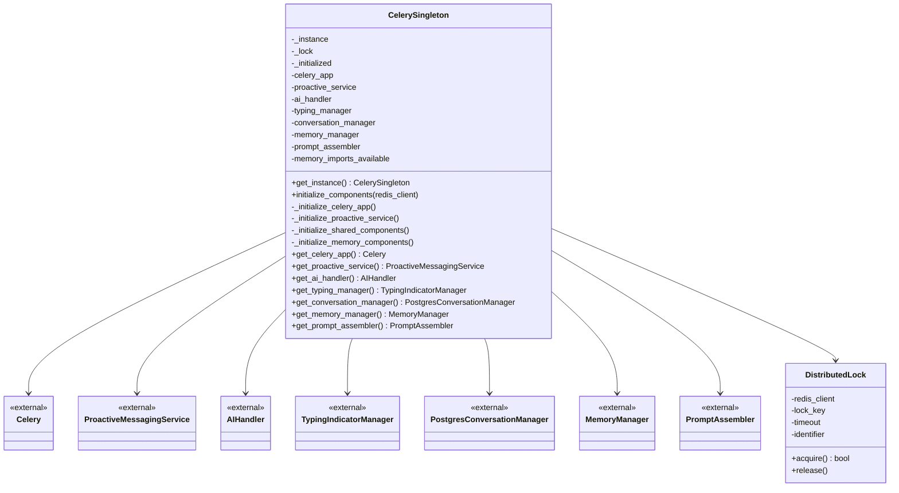
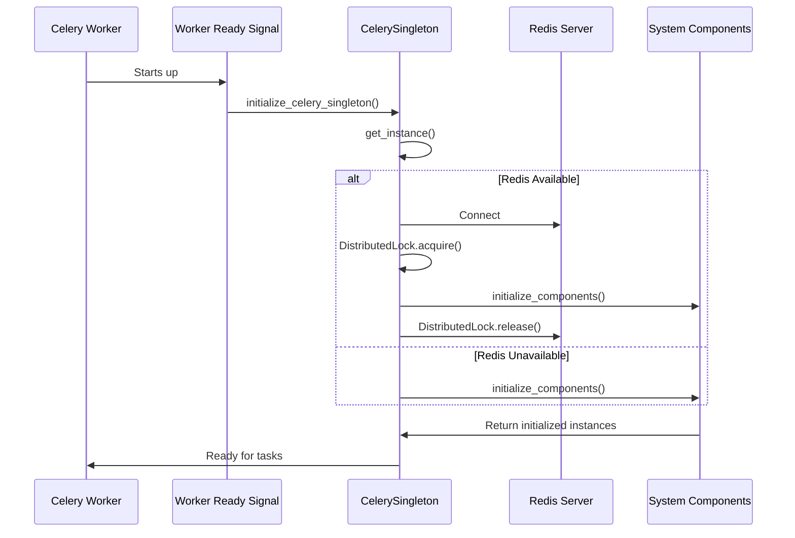

# Celery Singleton Pattern Design for Proactive Messaging System

## Current Issues Analysis

After analyzing the current implementation, I've identified several key issues:

1. **Multiple Celery App Instances**: The `celery_app` is created as a module-level instance in `proactive_messaging.py`, but there's potential for duplication in tests and other modules.

2. **Component Duplication**: In the `send_proactive_message` Celery task, new instances of components are created on every task execution:
   - `AIHandler()` 
   - `TypingIndicatorManager()`
   - `PostgresConversationManager()`
   - Memory components (`MemoryManager`, `PromptAssembler`)

3. **Inefficient Memory Component Imports**: Memory components are imported inside the task function rather than at the module level or during initialization.

4. **Initialization During Task Execution**: Components that should be initialized at startup are instead created during task execution, causing unnecessary overhead.

5. **No Consistent State Management**: Each task creates its own instances, leading to inconsistent state across tasks.

## Proposed Solution: CelerySingleton Class

I propose creating a `CelerySingleton` class that manages all Celery-related components as singletons, ensuring:

1. Single instance of Celery app across the application
2. Centralized component management
3. Proper initialization at startup
4. Consistent state across worker processes
5. Efficient memory component handling

## Design Overview

### Class Structure

```python
class CelerySingleton:
    _instance = None
    _lock = threading.Lock()
    
    # Core components
    celery_app: Celery
    proactive_service: ProactiveMessagingService
    
    # Shared components
    ai_handler: AIHandler
    typing_manager: TypingIndicatorManager
    conversation_manager: PostgresConversationManager
    
    # Memory components (optional)
    memory_manager: Optional[MemoryManager]
    prompt_assembler: Optional[PromptAssembler]
    
    def __new__(cls):
        # Thread-safe singleton implementation
        pass
        
    @classmethod
    def get_instance(cls) -> 'CelerySingleton':
        # Get singleton instance
        pass
        
    def initialize_components(self):
        # Initialize all components at startup
        pass
        
    def get_celery_app(self) -> Celery:
        # Get Celery app instance
        pass
        
    def get_proactive_service(self) -> ProactiveMessagingService:
        # Get proactive messaging service
        pass
        
    # Similar getters for other components...
```

### Key Design Principles

1. **Thread-Safe Singleton**: Using double-checked locking pattern for thread safety
2. **Lazy Initialization**: Components are initialized only when needed
3. **Startup Initialization**: Critical components are initialized at application startup
4. **Distributed Locking**: For multi-worker environments, use Redis-based locking
5. **Graceful Degradation**: Memory components are optional and won't break the system if unavailable

## Implementation Plan

### 1. CelerySingleton Class Implementation

The `CelerySingleton` class will manage:

- Celery app instance
- Proactive messaging service
- Shared AI components (AIHandler, TypingIndicatorManager, PostgresConversationManager)
- Memory components (MemoryManager, PromptAssembler) - if available

### 2. Initialization Flow

```
Application Startup
    ↓
Celery Worker Ready Signal
    ↓
CelerySingleton.initialize_components()
    ↓
Component Initialization (with distributed locking)
    ↓
Register Celery Tasks
    ↓
Ready for Task Execution
```

### 3. Component Lifecycle

- **At Startup**: Initialize shared components
- **During Tasks**: Reuse existing component instances
- **Error Handling**: Graceful recovery from component failures
- **Cleanup**: Proper resource cleanup when shutting down

## Distributed Locking Mechanism

For multi-worker environments, we'll implement a Redis-based distributed lock:

```python
class DistributedLock:
    def __init__(self, redis_client, lock_key, timeout=30):
        self.redis_client = redis_client
        self.lock_key = f"celery_singleton_init:{lock_key}"
        self.timeout = timeout
        self.identifier = str(uuid.uuid4())
        
    def acquire(self) -> bool:
        # Acquire lock with timeout
        pass
        
    def release(self):
        # Release lock
        pass
        
    def __enter__(self):
        # Context manager implementation
        pass
        
    def __exit__(self, exc_type, exc_val, exc_tb):
        # Context manager cleanup
        pass
```

This ensures only one worker process initializes the components, while others wait.

## Memory Component Optimization

Instead of importing memory components inside tasks, we'll:

1. Try to import at module level
2. Set flags for availability
3. Initialize only if imports succeed
4. Reuse instances across tasks

## Benefits of This Approach

1. **Performance**: Eliminates redundant component creation
2. **Consistency**: Ensures consistent state across tasks
3. **Resource Efficiency**: Reduces memory and CPU usage
4. **Maintainability**: Centralized component management
5. **Scalability**: Works well in multi-worker environments
6. **Reliability**: Proper error handling and graceful degradation

## Implementation Steps

1. Create `CelerySingleton` class with thread-safe singleton pattern
2. Implement distributed locking mechanism
3. Move component initialization to startup
4. Refactor `proactive_messaging.py` to use singleton
5. Update tests to work with new architecture
6. Add proper error handling and logging
7. Document the new architecture

This design will address all the identified issues while maintaining backward compatibility and ensuring robust operation in distributed environments.

## Detailed Implementation

### CelerySingleton Class Implementation

```python
import threading
import logging
from typing import Optional, TYPE_CHECKING
from celery import Celery

# Import components for proactive messaging
from config import (
    DATABASE_URL, USE_PGVECTOR, MEMORY_ENABLED
)
from ai_handler import AIHandler
from message_manager import TypingIndicatorManager
from storage_conversation_manager import PostgresConversationManager

if TYPE_CHECKING:
    from proactive_messaging import ProactiveMessagingService
    from memory.manager import MemoryManager
    from prompt.assembler import PromptAssembler

logger = logging.getLogger(__name__)

class CelerySingleton:
    _instance = None
    _lock = threading.Lock()
    _initialized = False
    
    def __new__(cls):
        if cls._instance is None:
            with cls._lock:
                # Double-checked locking pattern
                if cls._instance is None:
                    cls._instance = super().__new__(cls)
        return cls._instance
    
    def __init__(self):
        # Prevent re-initialization
        if hasattr(self, '_initialized') and self._initialized:
            return
        
        # Core components
        self.celery_app: Optional[Celery] = None
        self.proactive_service: Optional['ProactiveMessagingService'] = None
        
        # Shared components
        self.ai_handler: Optional[AIHandler] = None
        self.typing_manager: Optional[TypingIndicatorManager] = None
        self.conversation_manager: Optional[PostgresConversationManager] = None
        
        # Memory components (optional)
        self.memory_manager: Optional['MemoryManager'] = None
        self.prompt_assembler: Optional['PromptAssembler'] = None
        self.memory_imports_available = False
        
        self._initialized = True
    
    @classmethod
    def get_instance(cls) -> 'CelerySingleton':
        """Get the singleton instance of CelerySingleton."""
        return cls()
    
    def initialize_components(self, redis_client=None):
        """
        Initialize all components at startup.
        
        Args:
            redis_client: Redis client for distributed locking (optional)
        """
        # Use distributed lock if redis_client is provided
        if redis_client:
            from .distributed_lock import DistributedLock
            lock = DistributedLock(redis_client, "celery_singleton_init", timeout=60)
            if not lock.acquire():
                logger.warning("Could not acquire initialization lock, waiting for other process to complete")
                return
        
        try:
            # Initialize core components
            self._initialize_celery_app()
            self._initialize_proactive_service()
            self._initialize_shared_components()
            self._initialize_memory_components()
            
            logger.info("CelerySingleton components initialized successfully")
        except Exception as e:
            logger.error(f"Error initializing CelerySingleton components: {e}")
            raise
        finally:
            if redis_client:
                lock.release()
    
    def _initialize_celery_app(self):
        """Initialize the Celery app."""
        if self.celery_app is not None:
            return
        
        # Import celery configuration
        import celeryconfig
        
        # Initialize Celery
        self.celery_app = Celery('proactive_messaging')
        self.celery_app.config_from_object(celeryconfig)
        
        logger.info("Celery app initialized")
    
    def _initialize_proactive_service(self):
        """Initialize the proactive messaging service."""
        if self.proactive_service is not None:
            return
        
        # Import and initialize proactive messaging service
        from proactive_messaging import ProactiveMessagingService
        self.proactive_service = ProactiveMessagingService()
        
        logger.info("Proactive messaging service initialized")
    
    def _initialize_shared_components(self):
        """Initialize shared components."""
        if self.ai_handler is not None:
            return
        
        # Initialize shared components
        self.ai_handler = AIHandler()
        self.typing_manager = TypingIndicatorManager()
        self.conversation_manager = PostgresConversationManager(DATABASE_URL, USE_PGVECTOR)
        
        logger.info("Shared components initialized")
    
    def _initialize_memory_components(self):
        """Initialize memory components if available."""
        if self.memory_manager is not None or not MEMORY_ENABLED:
            return
        
        # Try to import memory components
        try:
            from memory.manager import MemoryManager
            from prompt.assembler import PromptAssembler
            self.memory_imports_available = True
        except ImportError as e:
            logger.warning(f"Memory/PromptAssembler imports failed: {e}")
            self.memory_imports_available = False
            return
        
        if not self.memory_imports_available:
            return
        
        # Initialize storage for memory components
        try:
            # Assuming conversation_manager is already initialized
            if hasattr(self.conversation_manager, 'storage') and self.conversation_manager.storage:
                storage = self.conversation_manager.storage
                
                # Create LLM summarize function that uses our AI handler
                async def llm_summarize_func(text: str, instruction: str = None) -> str:
                    """Summarization function using the bot's AI handler"""
                    try:
                        prompt = f"Please summarize the following conversation text:\n\n{text}"
                        if instruction:
                            prompt = f"{instruction}\n\n{text}"
                        
                        # Use a simple conversation history for summarization
                        simple_history = [{"role": "user", "content": prompt}]
                        response = await self.ai_handler.generate_response(prompt, [], None)  # No conversation_id for summarization
                        return response
                    except Exception as e:
                        logger.error("LLM summarization failed: %s", e)
                        return f"Summary unavailable due to error: {str(e)[:100]}"
                
                # Memory manager configuration
                from config import MEMORY_EMBED_MODEL, MEMORY_SUMMARIZER_MODE, MEMORY_CHUNK_OVERLAP
                memory_config = {
                    "embed_model": MEMORY_EMBED_MODEL,
                    "summarizer_mode": MEMORY_SUMMARIZER_MODE,
                    "llm_summarize": llm_summarize_func,
                    "chunk_overlap": MEMORY_CHUNK_OVERLAP
                }
                
                self.memory_manager = MemoryManager(
                    message_repo=storage.messages,
                    memory_repo=storage.memories,
                    conversation_repo=storage.conversations,
                    config=memory_config
                )
                logger.info("MemoryManager initialized successfully")
                
                # Initialize PromptAssembler
                from config import PROMPT_MAX_MEMORY_ITEMS, PROMPT_MEMORY_TOKEN_BUDGET_RATIO, PROMPT_TRUNCATION_LENGTH, PROMPT_INCLUDE_SYSTEM_TEMPLATE
                prompt_config = {
                    "max_memory_items": PROMPT_MAX_MEMORY_ITEMS,
                    "memory_token_budget_ratio": PROMPT_MEMORY_TOKEN_BUDGET_RATIO,
                    "truncation_length": PROMPT_TRUNCATION_LENGTH,
                    "include_system_template": PROMPT_INCLUDE_SYSTEM_TEMPLATE
                }
                
                self.prompt_assembler = PromptAssembler(
                    message_repo=storage.messages,
                    memory_manager=self.memory_manager,
                    persona_repo=storage.personas,
                    config=prompt_config
                )
                logger.info("PromptAssembler initialized successfully")
                
                # Set PromptAssembler in AIHandler
                self.ai_handler.set_prompt_assembler(self.prompt_assembler)
                logger.info("PromptAssembler integrated with AIHandler")
        except Exception as e:
            logger.error(f"Error initializing memory components: {e}")
            # Continue without memory components
    
    def get_celery_app(self) -> Celery:
        """Get the Celery app instance."""
        if self.celery_app is None:
            self._initialize_celery_app()
        return self.celery_app
    
    def get_proactive_service(self) -> 'ProactiveMessagingService':
        """Get the proactive messaging service."""
        if self.proactive_service is None:
            self._initialize_proactive_service()
        return self.proactive_service
    
    def get_ai_handler(self) -> AIHandler:
        """Get the AI handler."""
        if self.ai_handler is None:
            self._initialize_shared_components()
        return self.ai_handler
    
    def get_typing_manager(self) -> TypingIndicatorManager:
        """Get the typing manager."""
        if self.typing_manager is None:
            self._initialize_shared_components()
        return self.typing_manager
    
    def get_conversation_manager(self) -> PostgresConversationManager:
        """Get the conversation manager."""
        if self.conversation_manager is None:
            self._initialize_shared_components()
        return self.conversation_manager
    
    def get_memory_manager(self) -> Optional['MemoryManager']:
        """Get the memory manager if available."""
        if self.memory_manager is None and self.memory_imports_available:
            self._initialize_memory_components()
        return self.memory_manager
    
    def get_prompt_assembler(self) -> Optional['PromptAssembler']:
        """Get the prompt assembler if available."""
        if self.prompt_assembler is None and self.memory_imports_available:
            self._initialize_memory_components()
        return self.prompt_assembler
```

### Distributed Lock Implementation

```python
import uuid
import time
import logging

logger = logging.getLogger(__name__)

class DistributedLock:
    def __init__(self, redis_client, lock_key, timeout=30):
        self.redis_client = redis_client
        self.lock_key = f"celery_singleton_init:{lock_key}"
        self.timeout = timeout
        self.identifier = str(uuid.uuid4())
    
    def acquire(self) -> bool:
        """
        Acquire the distributed lock.
        
        Returns:
            bool: True if lock acquired, False otherwise
        """
        end_time = time.time() + self.timeout
        
        while time.time() < end_time:
            # Try to set the lock with NX (not exists) and EX (expire) options
            if self.redis_client.set(self.lock_key, self.identifier, nx=True, ex=self.timeout):
                logger.info(f"Acquired distributed lock: {self.lock_key}")
                return True
            
            # Wait before retrying
            time.sleep(0.1)
        
        logger.warning(f"Failed to acquire distributed lock: {self.lock_key}")
        return False
    
    def release(self):
        """Release the distributed lock."""
        # Lua script to atomically check and delete the lock
        lua_script = """
        if redis.call("GET", KEYS[1]) == ARGV[1] then
            return redis.call("DEL", KEYS[1])
        else
            return 0
        end
        """
        
        try:
            result = self.redis_client.eval(lua_script, 1, self.lock_key, self.identifier)
            if result:
                logger.info(f"Released distributed lock: {self.lock_key}")
            else:
                logger.warning(f"Failed to release distributed lock: {self.lock_key} (not owner)")
        except Exception as e:
            logger.error(f"Error releasing distributed lock: {e}")
    
    def __enter__(self):
        """Context manager entry."""
        if not self.acquire():
            raise RuntimeError("Could not acquire distributed lock")
        return self
    
    def __exit__(self, exc_type, exc_val, exc_tb):
        """Context manager exit."""
        self.release()
```

### Updated Proactive Messaging Service

The proactive messaging service will be updated to use the singleton pattern:

```python
# In proactive_messaging.py

# Remove the global instance
# proactive_messaging_service = ProactiveMessagingService()

# Instead, use the singleton
from celery_singleton import CelerySingleton

# Get singleton instance
celery_singleton = CelerySingleton.get_instance()

@celery_singleton.get_celery_app().task(bind=True)
def send_proactive_message(self, user_id: int):
    """Celery task to send a proactive message to a user."""
    # Get components from singleton
    proactive_service = celery_singleton.get_proactive_service()
    ai_handler = celery_singleton.get_ai_handler()
    typing_manager = celery_singleton.get_typing_manager()
    conversation_manager = celery_singleton.get_conversation_manager()
    memory_manager = celery_singleton.get_memory_manager()
    prompt_assembler = celery_singleton.get_prompt_assembler()
    
    # ... rest of the implementation
```

This approach ensures that all components are initialized once and reused across tasks, eliminating the duplication issues identified in the current implementation.

## Implementing Proper Initialization at Startup

To ensure components are initialized at startup rather than during task execution, we'll leverage Celery's worker ready signal:

```python
# In celery_singleton.py or in the main application file

from celery.signals import worker_ready
from .celery_singleton import CelerySingleton

@worker_ready.connect
def initialize_celery_singleton(sender=None, **kwargs):
    """
    Initialize the CelerySingleton when the Celery worker is ready.
    This ensures all components are initialized at startup.
    """
    logger.info("Celery worker is ready, initializing CelerySingleton...")
    try:
        # Get singleton instance
        celery_singleton = CelerySingleton.get_instance()
        
        # Initialize components
        # If Redis is available, use it for distributed locking
        from config import PROACTIVE_MESSAGING_REDIS_URL
        try:
            import redis
            redis_client = redis.from_url(PROACTIVE_MESSAGING_REDIS_URL)
            celery_singleton.initialize_components(redis_client=redis_client)
        except Exception as e:
            logger.warning(f"Could not connect to Redis for distributed locking: {e}")
            # Initialize without distributed locking
            celery_singleton.initialize_components()
        
        logger.info("CelerySingleton initialized successfully at startup")
    except Exception as e:
        logger.error(f"Error initializing CelerySingleton at startup: {e}")
        raise
```

This approach ensures that:

1. All components are initialized when the Celery worker starts
2. Distributed locking is used when Redis is available to prevent multiple workers from initializing simultaneously
3. Components are ready before any tasks are executed
4. Resource usage is optimized by avoiding repeated initialization

## Benefits of Startup Initialization

1. **Performance**: Eliminates initialization overhead during task execution
2. **Consistency**: Ensures all components are ready before tasks run
3. **Resource Management**: Properly manages connections and resources
4. **Error Handling**: Catches initialization errors early
5. **Scalability**: Works well in multi-worker environments

## Class Diagram



## Sequence Diagram



## Refactoring Memory Component Imports

To improve efficiency of memory component imports, we'll move the imports to the module level and use lazy initialization:

```python
# At module level in celery_singleton.py
try:
    from memory.manager import MemoryManager
    from prompt.assembler import PromptAssembler
    MEMORY_IMPORTS_AVAILABLE = True
except ImportError as e:
    logger.warning(f"Memory/PromptAssembler imports failed at module level: {e}")
    MEMORY_IMPORTS_AVAILABLE = False
    MemoryManager = None
    PromptAssembler = None

class CelerySingleton:
    # ... existing code ...
    
    def _initialize_memory_components(self):
        """Initialize memory components if available."""
        if self.memory_manager is not None or not MEMORY_ENABLED or not MEMORY_IMPORTS_AVAILABLE:
            return
            
        # Rest of the initialization code remains the same
        # ...
```

This approach ensures that:

1. Imports are attempted at module load time
2. Failed imports are cached to avoid repeated attempts
3. Memory components are only initialized if imports succeed
4. The system gracefully degrades if memory components are unavailable

## Ensuring Consistent State Across Multiple Worker Processes

To ensure consistent state across multiple worker processes:

1. **Shared Redis Storage**: User state and task information is stored in Redis, which is shared across all workers
2. **Distributed Locking**: Prevents multiple workers from initializing components simultaneously
3. **Immutable Configuration**: Configuration values are read-only and consistent across processes
4. **Stateless Components**: Components that maintain state do so in external storage (Redis, PostgreSQL)

## Updated Architecture Documentation

The refactored architecture provides:

1. **Centralized Component Management**: All components are managed by a single singleton instance
2. **Proper Initialization Timing**: Components are initialized at startup, not during task execution
3. **Efficient Resource Usage**: Components are reused across tasks, reducing overhead
4. **Scalable Design**: Works well in multi-worker environments with proper locking
5. **Graceful Degradation**: System continues to function even if optional components fail
6. **Improved Maintainability**: Clear separation of concerns and centralized management

This design addresses all the identified issues while maintaining backward compatibility and ensuring robust operation in distributed environments.