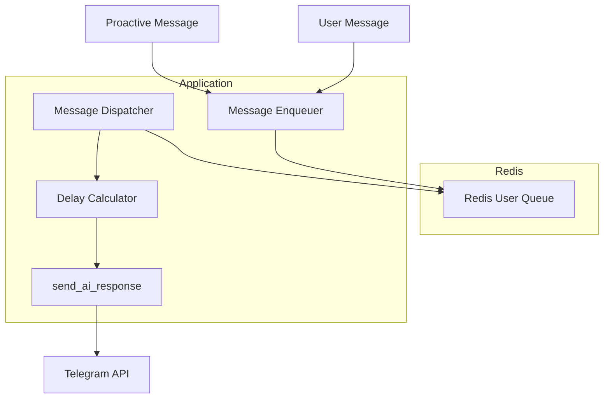
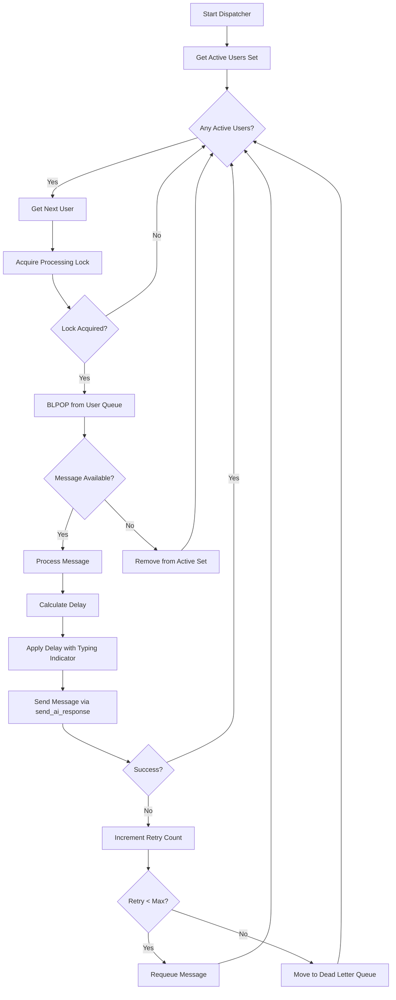

# Redis-Based Message Queue Architecture for AI Girlfriend Bot

## 1. Overview

This document outlines the architectural design for a Redis-based message queue system to prevent parallel execution of the `send_ai_response` function for the same user in the AI Girlfriend Bot system. The solution implements user-specific Redis lists with a dispatcher mechanism that processes messages sequentially with configurable delays.

## 2. Current System Context

The application currently uses:
- Redis for Celery task queuing and proactive messaging
- PostgreSQL for data storage
- Celery for distributed task processing
- Telegram bot for user interactions

The `send_ai_response` function can be called in parallel from:
1. Regular message processing flow in `bot.py`
2. Proactive messaging system in `proactive_messaging.py`

## 3. Solution Architecture

### 3.1 High-Level Architecture



### 3.2 Components

1. **Message Enqueuer**: Replaces direct calls to `send_ai_response` with Redis queue operations
2. **Redis User Queues**: Per-user Redis lists storing messages to be processed
3. **Message Dispatcher**: Processes messages from user queues sequentially
4. **Delay Calculator**: Implements delay mechanism based on current `send_ai_response` logic
5. **Error Handler**: Manages retries and dead letter queues for failed messages

## 4. Redis Data Structure Design

### 4.1 User Message Queues

Each user has their own Redis list with the key format:
```
queue:{user_id}
```

Example:
```
queue:12345  # Queue for user with ID 12345
```

### 4.2 Message Format

Messages stored in the queue are JSON objects with the following structure:
```json
{
  "user_id": 12345,
  "chat_id": 12345,
  "text": "Message content",
  "timestamp": "2025-09-08T15:00:0Z",
  "message_type": "regular|proactive",
  "retry_count": 0,
  "metadata": {
    // Additional metadata for processing
  }
}
```

### 4.3 Queue Management Keys

Additional Redis keys for queue management:
```
dispatcher:active_users        # Set of user IDs with active queues
dispatcher:processing:{user_id} # Lock key to ensure single dispatcher per user
dlq:{user_id}                  # Dead letter queue for failed messages
```

## 5. Dispatcher Mechanism

### 5.1 Single Dispatcher Design

The system uses a single dispatcher process that:
1. Monitors active user queues
2. Processes messages sequentially for each user
3. Implements delays between messages as per current `send_ai_response` logic
4. Handles errors with retry mechanism and dead letter queues

### 5.2 Dispatcher Workflow



### 5.3 Distributed Locking

To ensure only one dispatcher processes a given user's queue at a time:
- Use Redis `SET` with `NX` and `EX` options for locks
- Lock key: `dispatcher:processing:{user_id}`
- Expiration time: Configurable (default 30 seconds)

## 6. Delay Mechanism

The delay mechanism replicates the current `send_ai_response` implementation:

1. **Calculate Base Delay**:
   ```
   base_delay = message_length / typing_speed
   ```

2. **Add Random Offset**:
   ```
   total_delay = base_delay + random_offset
   ```

3. **Apply Maximum Limit**:
   ```
   final_delay = min(total_delay, MAX_DELAY)
   ```

4. **Show Typing Indicator** (if delay > 0.7 seconds)

## 7. Startup Processing

On application startup:
1. Scan Redis for existing user queues
2. Add users with non-empty queues to the active users set
3. Start dispatcher to process queued messages
4. Continue normal message processing

## 8. Error Handling and Recovery

### 8.1 Retry Mechanism

- Maximum retry attempts: Configurable (default 3)
- Retry counter stored in message metadata
- Exponential backoff between retries

### 8.2 Dead Letter Queue

Failed messages after max retries are moved to:
```
dlq:{user_id}
```

### 8.3 Redis Connection Issues

- Implement connection retry with exponential backoff
- Log errors and continue processing other queues
- Alert on persistent connection failures

## 9. Configuration Parameters

### 9.1 New Configuration Parameters

```python
# config.py
MESSAGE_QUEUE_REDIS_URL = os.getenv('MESSAGE_QUEUE_REDIS_URL', 'redis://redis:6379/0')
MESSAGE_QUEUE_MAX_RETRIES = int(os.getenv('MESSAGE_QUEUE_MAX_RETRIES', '3'))
MESSAGE_QUEUE_LOCK_TIMEOUT = int(os.getenv('MESSAGE_QUEUE_LOCK_TIMEOUT', '30'))
MESSAGE_QUEUE_DISPATCHER_INTERVAL = float(os.getenv('MESSAGE_QUEUE_DISPATCHER_INTERVAL', '0.1'))
```

### 9.2 Environment Variables

```env
# .env
MESSAGE_QUEUE_REDIS_URL=redis://redis:6379/0
MESSAGE_QUEUE_MAX_RETRIES=3
MESSAGE_QUEUE_LOCK_TIMEOUT=30
MESSAGE_QUEUE_DISPATCHER_INTERVAL=0.1
```

## 10. Class/Interface Definitions

### 10.1 MessageQueueManager

```python
class MessageQueueManager:
    def __init__(self, redis_client):
        self.redis_client = redis_client
    
    async def enqueue_message(self, user_id: int, chat_id: int, text: str, message_type: str = "regular"):
        """Enqueue a message for a user"""
        pass
    
    async def get_queue_size(self, user_id: int) -> int:
        """Get the size of a user's queue"""
        pass
    
    async def is_queue_empty(self, user_id: int) -> bool:
        """Check if a user's queue is empty"""
        pass
```

### 10.2 MessageDispatcher

```python
class MessageDispatcher:
    def __init__(self, redis_url: str, max_retries: int = 3, lock_timeout: int = 30):
        """
        Initialize the MessageDispatcher.
        
        Args:
            redis_url: Redis connection URL
            max_retries: Maximum number of retries for failed messages
            lock_timeout: Timeout for distributed locks in seconds
        """
        self.redis_client = redis.from_url(redis_url)
        self.max_retries = max_retries
        self.lock_timeout = lock_timeout
        self.running = False
    
    async def start_dispatching(self):
        """Start the dispatcher loop."""
        # Implementation scans for existing queues at startup and processes messages
        pass
    
    async def stop_dispatching(self):
        """Stop the dispatcher loop."""
        pass
    
    async def process_user_queue(self, user_id: int):
        """Process messages from a user's queue."""
        pass
    
    async def process_message(self, message: dict):
        """Process a single message."""
        pass
```
## 11. Integration Plan

### 11.1 Bot Integration

In `bot.py`, replace direct calls to `send_ai_response` in `_dispatch_buffered_message`:

```python
# Current implementation
await send_ai_response(chat_id=chat_id, text=cleaned_ai_response, bot=bot, typing_manager=self.typing_manager)

# New implementation
await message_queue_manager.enqueue_message(
    user_id=user_id,
    chat_id=chat_id,
    text=cleaned_ai_response,
    message_type="regular"
)
```

### 11.2 Proactive Messaging Integration

In `proactive_messaging.py`, replace direct calls to `send_ai_response` in `send_proactive_message`:

```python
# Current implementation
await send_ai_response(chat_id=user_id, text=cleaned_response, bot=bot, typing_manager=typing_manager)

# New implementation
await message_queue_manager.enqueue_message(
    user_id=user_id,
    chat_id=user_id,  # For proactive messages, chat_id is typically the same as user_id
    text=cleaned_response,
    message_type="proactive"
)
```

### 11.3 Application Startup

Initialize the message queue components and start the dispatcher:

```python
# In bot.py::__init__
try:
    self.message_queue_manager = MessageQueueManager(MESSAGE_QUEUE_REDIS_URL)
    logger.info("Message queue manager initialized successfully")
except Exception as e:
    logger.error("Failed to initialize message queue manager: %s", e)
    self.message_queue_manager = None

try:
    self.message_dispatcher = MessageDispatcher(
        MESSAGE_QUEUE_REDIS_URL,
        MESSAGE_QUEUE_MAX_RETRIES,
        MESSAGE_QUEUE_LOCK_TIMEOUT
    )
    logger.info("Message dispatcher initialized successfully")
except Exception as e:
    logger.error("Failed to initialize message dispatcher: %s", e)
    self.message_dispatcher = None

# In bot initialization function
# Start message dispatcher in background task
if self.message_dispatcher:
    try:
        self.dispatcher_task = asyncio.create_task(self.message_dispatcher.start_dispatching())
        logger.info("Message dispatcher started successfully")
    except Exception as e:
        logger.error("Failed to start message dispatcher: %s", e)
```

## 12. Testing Strategy

### 12.1 Unit Tests

1. Test `MessageQueueManager` enqueue/dequeue operations
2. Test `MessageDispatcher` processing logic
3. Test error handling and retry mechanisms

### 12.2 Integration Tests

1. Test parallel message enqueueing for same user
2. Test sequential processing with delays
3. Test error recovery and dead letter queue functionality
4. Test startup processing of queued messages

### 12.3 Performance Tests

1. Measure latency impact of queue operations
2. Test system throughput with multiple users
3. Validate dispatcher performance under load

## 13. Monitoring and Observability

### 13.1 Metrics to Track

1. Queue sizes per user
2. Message processing latency
3. Retry rates and failure rates
4. Dispatcher processing time
5. Redis connection health

### 13.2 Logging

1. Message enqueue/dequeue events
2. Processing start/end events
3. Error and retry events
4. Dispatcher state changes
5. Performance metrics

## 14. Deployment Considerations

### 14.1 Backward Compatibility

The solution maintains backward compatibility by:
1. Preserving existing `send_ai_response` function for direct use if needed
2. Allowing gradual migration of call sites
3. Providing clear documentation for the new approach

### 14.2 Rollout Strategy

1. Implement the new components
2. Deploy with queueing disabled (direct to `send_ai_response`)
3. Enable queueing for a subset of users
4. Monitor system behavior and performance
5. Gradually enable for all users
6. Remove direct `send_ai_response` calls after complete migration

## 15. Future Enhancements

### 15.1 Priority Queues

Implement message priorities for different message types:
- Proactive messages: Lower priority
- User-initiated messages: Higher priority

### 15.2 Rate Limiting

Add configurable rate limiting per user to prevent message flooding.

### 15.3 Queue Sharding

For high-scale deployments, implement queue sharding across multiple Redis instances.

## 16. Conclusion

This Redis-based message queue architecture provides a robust solution for preventing parallel execution of the `send_ai_response` function while maintaining system performance and reliability. By using user-specific queues with a single dispatcher, the system ensures serialized message processing with configurable delays, error handling, and persistence across restarts.